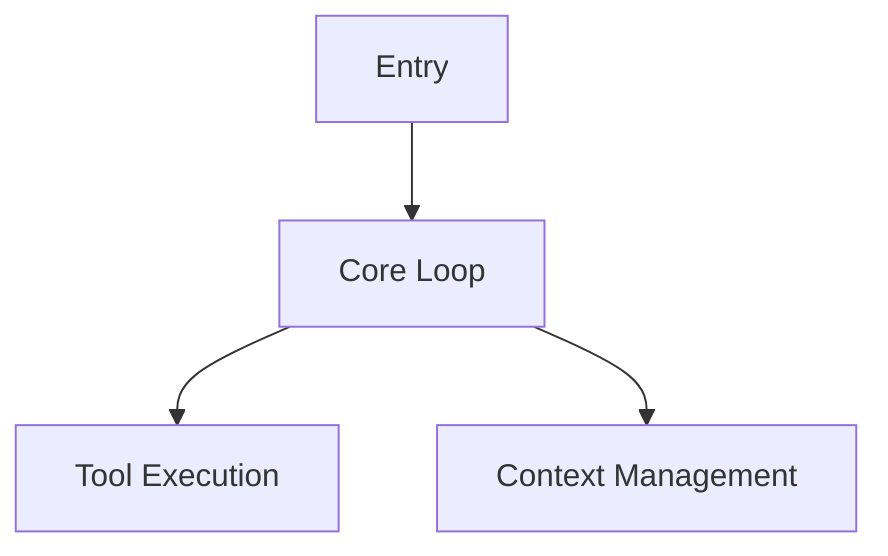

# Code Reader

通用源码阅读工作流，帮助系统化理解复杂项目架构。

## 笔记路径

默认: `E:\JourneyIntoAI\DL_and_LLM\expirements\notebooks\LLM notebook\agents_notebook`

## 阅读重点筛选

学习目标是**设计思想**，而非实现细节。阅读时需主动甄别：

**重点关注**:

- 架构设计、模块职责划分
- 数据流转、核心抽象
- 设计决策背后的权衡

**跳过忽略**:

- 日志输出、调试代码
- 针对特定模型/厂商的优化
- 实验性 feature flag 分支
- 内部员工专属功能 (`USER_TYPE === 'ant'`)

**甄别信号**:

- `feature('XXX')` 实验性 → 跳过
- 注释 "ant-only" / "internal" → 跳过
- 函数名含 `log`/`debug`/`trace` → 跳过
- 模块名含 `analytics`/`telemetry` → 跳过

---

## 阶段 1: 初始化

当用户调用 `/code-reader` 或说"开始读新项目"时执行。

### 1.1 检测项目目录

使用以下方法识别项目名（按优先级）：

1. 读取 `package.json` 的 `name` 字段
2. 读取 `.git/config` 的 remote URL，提取项目名
3. 使用当前文件夹名

### 1.2 确认项目

输出确认信息：

> "检测到你在 **{项目名}** 目录，要开始/继续阅读吗？"

等待用户确认。

### 1.3 检查笔记目录

检查 `{笔记路径}/{项目名}/` 是否存在：

- **已存在**: 读取 `progress.md`，询问用户"继续上次进度还是重新开始？"
- **不存在**: 创建目录结构

### 1.4 创建目录结构

```text
{笔记路径}/{项目名}/
├── progress.md
├── summary.md (空文件)
└── modules/ (空目录)
```

### 1.5 写入 progress.md 模板

```markdown
# {项目名} 阅读进度

## 当前状态
- 正在读: 无
- 下一步: 选择第一个模块开始阅读

## 已完成模块
| 模块 | L1 | L2 | L3 | Review |
|------|----|----|----|----|

## 计划模块
- (待用户指定)
```

### 1.6 询问模块

> "你想先读哪个模块？建议从核心入口文件开始（如 `main.ts`、`index.ts`、`query.ts` 等）。"

等待用户指定模块名。

---

## 阶段 2: 阅读 (read-module)

当用户说"开始读 {模块名}"或"继续"时执行。

### 2.1 确定目标

从用户输入或 progress.md 获取当前模块名。

### 2.2 扫描源码

使用 Glob 和 Grep 定位模块核心文件：

- 搜索 `{模块名}.ts` 或 `{模块名}/`
- 识别文件大小，优先读主文件

### 2.3 执行当前层级阅读

根据 progress.md 状态确定层级：

#### L1 - 黑盒视角

生成以下内容：

**职责**: 一句话描述模块做什么

**输入**: 列出主要参数/依赖

**输出**: 列出返回值/副作用

**调用时机**: 何时被使用，被谁触发

**调用方**: 列出哪些模块调用它（使用 wikilink `[[模块名]]`）

**黑盒调用记录**: 遇到外部依赖时，只记录"调了什么、返回什么"，不深入：

```text
- `Permission.check()` → 返回 bool，作用是检查权限
- `Compact.run()` → 返回压缩后的消息列表
```

**TS 语法解释**: 遇到陌生语法时，先解释再继续

#### L2 - 接口视角

**核心函数表格**:

| 函数名 | 作用 | 关键参数 |

**核心类型摘录**: 关键类型定义

#### L3 - 实现视角

**关键代码路径**: 伪代码/流程图

**边界条件**: 错误处理、特殊情况

**性能考量**: 缓存、异步设计

### 2.4 写入笔记

写入 `{笔记路径}/{项目名}/modules/{模块名}.md`，使用模板格式。

### 2.5 更新进度

更新 `progress.md`:

- 更新"当前状态"
- 更新"已完成模块"表格对应列

### 2.6 Review 提示

完成当前层级后，输出：

> "**{模块名}** 的 **{L1/L2/L3}** 已完成。需要 review 吗？"
>
> - 输入 `review` 开始 review
> - 输入 `继续` 进入下一层级
> - 输入其他模块名切换模块

---

## 阶段 3: Review (review-module)

当用户说"review"或 AI 主动建议时执行。

### 3.1 Git 提交 (pre-review)

执行 git 提交：

```bash
cd "{笔记路径}"
git add -A
git commit -m "pre-review: {模块名} {层级}"
```

### 3.2 读取笔记

读取 `{笔记路径}/{项目名}/modules/{模块名}.md`

### 3.3 验证结论

结合源码验证笔记中每个结论：

1. 读取笔记中的"职责"、"输入"、"输出"等描述
2. 回到源码验证准确性
3. 标记发现的错误

### 3.4 更新错误结论

对每个错误，使用以下格式：

```markdown
~~原结论~~
> ❌ **错误理解**: {错误原因分析}
> **正确理解**: {新结论}
```

### 3.5 更新笔记文件

写入修改后的内容到 `{模块名}.md`

### 3.6 更新 Review 历史

在笔记"Review 历史"部分添加新条目：

```markdown
### {日期} - {层级} Review

#### {字段名}
~~原结论~~
> ❌ **错误理解**: {原因}
> **正确理解**: {新结论}
```

### 3.7 更新 progress.md

更新"已完成模块"表格的 Review 列。

### 3.8 Git 提交 (post-review)

```bash
cd "{笔记路径}"
git add -A
git commit -m "post-review: {模块名} {层级}"
```

### 3.9 输出结果

> "Review 完成。发现 {N} 处修正。"
>
> - 输入 `继续` 进入下一层级
> - 输入其他模块名切换模块

---

## 阶段 4: 项目总结 (project-summary)

当用户说"这个项目读完了，开始写总结"时执行。

### 4.1 汇总模块笔记

读取 `{笔记路径}/{项目名}/modules/` 下所有笔记。

### 4.2 生成架构总览

使用 mermaid 生成架构图：



### 4.3 协助撰写 summary.md

引导用户撰写万字总结：

- 先生成大纲
- 用户主导内容，AI 辅助组织结构
- 分章节完成

### 4.4 询问跨项目对比

> "项目总结完成。是否开始跨项目对比？"
>
> - 输入 `对比 {项目A} 和 {项目B} 的 {模块}` 开始对比
> - 输入 `结束` 退出

---

## 阶段 5: 跨项目对比 (cross-analyze)

当用户说"对比 {项目A} 和 {项目B} 的 {模块}"时执行。

### 5.1 读取两个项目的笔记

读取:

- `{笔记路径}/{项目A}/modules/{模块}.md`
- `{笔记路径}/{项目B}/modules/{模块}.md`

### 5.2 生成对比表格

对比维度:

- 职责定义
- 输入输出
- 调用时机
- 核心抽象
- 设计权衡

### 5.3 写入对比笔记

写入 `{笔记路径}/cross-analysis/{主题}.md`:

```markdown
# {主题} 跨项目对比

> 对比项目: [[{项目A}]] vs [[{项目B}]]
> 模块: {模块名}

## 职责定义

| 项目 | 定义 |
|------|------|
| {项目A} | ... |
| {项目B} | ... |

## 输入输出

| 项目 | 输入 | 输出 |
|------|------|------|
| {项目A} | ... | ... |
| {项目B} | ... | ... |

## 设计权衡分析

{项目A} 采用了 XXX 方案，优势是 ...，代价是 ...
{项目B} 采用了 YYY 方案，优势是 ...，代价是 ...

## 结论

...
```

### 5.4 更新 wikilink

确保两个项目笔记中添加相关链接：

- `{项目A}/modules/{模块}.md` 添加 `[[../cross-analysis/{主题}]]`
- `{项目B}/modules/{模块}.md` 添加 `[[../cross-analysis/{主题}]]`

---

## 模块笔记模板

每次创建新模块笔记时使用此模板：

```markdown
# {模块名}

> 项目: [[{项目名}]]
> 文件: {文件路径}
> 状态: L1-in-progress

## L1 - 黑盒视角

### 职责
{一句话描述}

### 输入
- {参数/依赖}

### 输出
- {返回值/副作用}

### 调用时机
{何时被使用}

### 调用方
- [[{模块A}]]
- [[{模块B}]]

### 黑盒调用记录
- `{函数}()` → {返回}, 作用是 {描述}

## L2 - 接口视角

### 核心函数
| 函数名 | 作用 | 关键参数 |
|--------|------|----------|

### 核心类型
```typescript
// 类型摘录
```

## L3 - 实现视角

### 关键代码路径
```text
{伪代码/流程图}
```

### 边界条件
- {错误处理}

### 性能考量
- {缓存/异步}

## Review 历史

## 疑问与待查
- [ ] {问题}

## 相关模块
- [[{模块}]]
```

---

## TypeScript 语法解释参考

阅读时遇到陌生语法，先解释再继续：

### yield* (委托生成器)

`yield* expr` 将 expr 的所有 yield 值逐个传递出去，最后返回 expr 的 return 值。

```typescript
function* inner() {
  yield 1;
  yield 2;
  return 'done';
}

function* outer() {
  const result = yield* inner(); // result = 'done'
  yield 3;
}

// outer() 依次 yield: 1, 2, 3
```

### ?. (可选链)

`obj?.prop` 若 obj 为 null/undefined，返回 undefined 而不报错。

### ?? (空值合并)

`a ?? b` 若 a 为 null/undefined，返回 b。区别于 `||`：`||` 对 falsy 值（0, '', false）也生效。

### 泛型

`function foo<T>(x: T): T` 定义类型参数 T，调用时 `foo<string>('hi')` 或自动推断。

### 类型守卫

`if (typeof x === 'string')` 在分支内 x 被收窄为 string 类型。